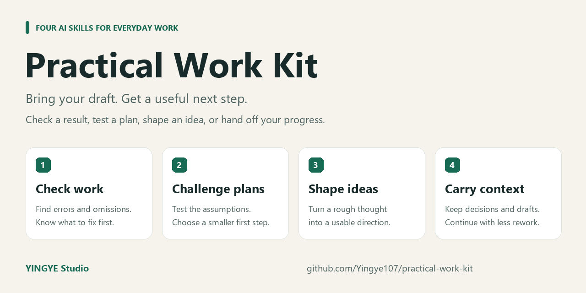

# Practical Work Kit · 實用工作四助手



Four reusable AI skills for checking work, challenging plans, shaping ideas, and carrying context into the next conversation.

[繁體中文](README.zh-TW.md) · [Examples](docs/EXAMPLES.md) · [Latest release](https://github.com/Yingye107/practical-work-kit/releases/latest) · [License](LICENSE)

Give the assistant the material you already have and say what you need. The skills aim to produce useful answers at the requested scale: a short message gets a short review, three titles stay three titles, and a handoff preserves the draft you actually wrote.

| Skill | Use it when you need… | Example request |
|---|---|---|
| `check-my-work` | Errors, omissions, and evidence behind a finished result | “Check this budget and tell me what needs fixing.” |
| `challenge-my-plan` | A second perspective on a plan and its assumptions | “Challenge this launch plan and suggest a smaller first test.” |
| `shape-my-idea` | A concrete direction, draft, or first experiment | “Turn this idea into three video concepts I can make this weekend.” |
| `carry-my-context` | A concise note for another person or conversation | “Keep my decisions, current draft, and next step in a handoff.” |

## See it in one minute

Try a small budget check after installation:

```text
Use $check-my-work to check this budget.
Venue: 3,000. Materials: 2,000. Listed total: 6,000.
I have not provided receipts or confirmed tax.
Give me a short correction and say what remains unchecked.
```

**What a useful answer should do:** correct the total to **5,000**, flag the **1,000** difference, and leave receipts and tax marked as unverified. You can immediately fix the arithmetic and see what still needs checking.

This is a worked example, not a guaranteed model response. See [four complete input/output examples](docs/EXAMPLES.md) to try the other skills.

## Install in Codex

Use a Codex CLI with the `plugin` commands available:

```sh
codex plugin marketplace add Yingye107/practical-work-kit --ref main
codex plugin add practical-work-kit@practical-work-kit
```

Start a new conversation after installation. To inspect the installation:

```sh
codex plugin list --marketplace practical-work-kit --json
```

For a fixed release, use `--ref v0.1.0` instead of `--ref main`. If your CLI does not recognize `plugin`, see the [official marketplace documentation](https://developers.openai.com/plugins/build/plugins) for your host and version. GitHub distribution and the OpenAI public plugin directory have separate installation and review paths; this repository does not claim a public-directory listing.

Prefer downloading a ZIP? Get `practical-work-kit-0.1.0.zip` and `SHA256SUMS.txt` from [Releases](https://github.com/Yingye107/practical-work-kit/releases), extract it into a dedicated folder, and follow [INSTALL.txt](INSTALL.txt).

Install one source of these skills. If you already use a local copy or individual versions, avoid enabling duplicate copies alongside this bundle.

## Try it

Paste your material after an explicit skill request:

```text
Use $check-my-work to check this budget.
Venue: 3,000. Materials: 2,000. Listed total: 6,000.
Tell me whether the calculation is right and what was not checked.
```

```text
Use $shape-my-idea to give me three titles for a five-minute video
about organizing a small work desk. Keep the tone friendly.
```

You can ask in your own language and set the length. Explicit names make it clear which skill you want; automatic selection depends on the host. See [four worked examples](docs/EXAMPLES.md) and [QUICK_START.txt](QUICK_START.txt).

## What this package does

The installable package contains instructions, supporting references, and interface metadata. It adds no MCP server, account connection, background hook, installer, or runtime script. Optional Python tools in the source repository validate and build releases; they do not run when using a skill.

Tools and readable attachments can deepen a review, but pasted text is enough to start. The skills use available evidence, distinguish a proposal from a finished result, and keep external actions inside the user's authorization. They do not restore another conversation's files or provide permanent memory.

These are instructions for an AI host. They cannot enforce a sandbox or guarantee correctness, confidentiality, immunity to prompt injection, or independent expert review. Keep secrets out of shared inputs and use the host's permission controls. For detailed boundaries and private vulnerability reporting, read [SECURITY.md](SECURITY.md).

## Contribute

Useful contributions improve real tasks with less effort for the user: clearer triggers, better examples, a demonstrated failure, or a smaller workflow. Please include a reproducible example with sensitive data removed. Start with [CONTRIBUTING.md](CONTRIBUTING.md) and our [Code of Conduct](CODE_OF_CONDUCT.md).

Maintainers can validate and build with Python 3.11 or newer and Git. The Python tools use only the standard library:

```sh
python tools/validate.py
python -m unittest discover -s tests -v
python tools/build_release.py --output dist
```

The CI checks package boundaries, references, metadata, license fingerprints, bounded secret signatures, and negative controls. Passing these checks is not a legal certification or a complete security audit. Changes to skills still need representative task checks.

## License and sources

Published by [YINGYE Studio](https://github.com/Yingye107). The package is licensed under [Apache-2.0](LICENSE). Selected methods informed the newly written instructions; upstream licenses and attribution are retained in [SOURCE_NOTICES.txt](SOURCE_NOTICES.txt), [licenses/](licenses/), and [provenance.json](provenance.json). Preserve them when redistributing. No upstream scripts or services are bundled.

See [CHANGELOG.md](CHANGELOG.md) for releases.
